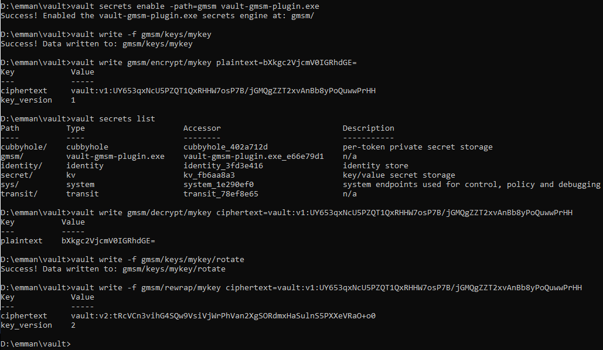
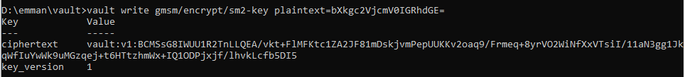
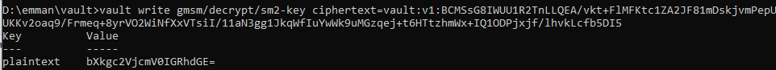
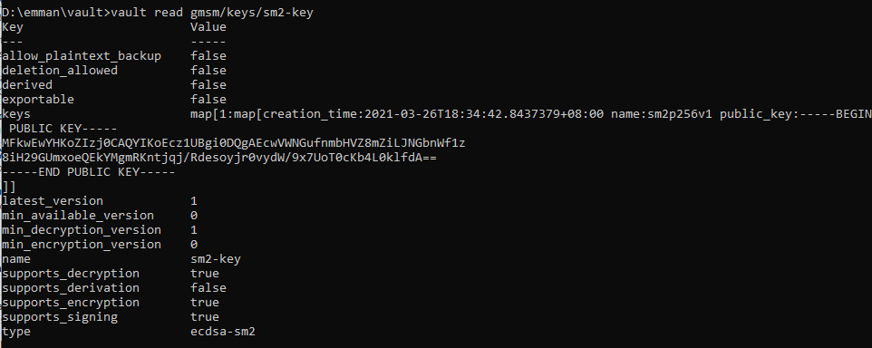
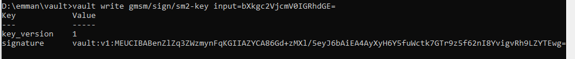
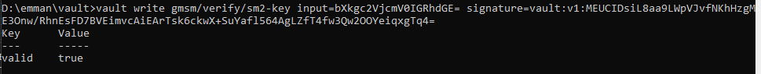

# Vault plugin: GMSM

  

1. **sm4_gcm96** is supported now, SM4-GCM with a 128-bit SM4 key and a 96-bit nonce; supports encryption, decryption, key derivation, and convergent encryption.
2. **ecdsa-sm2** is also supported, this key type can be used for encryption/decryption, sign/verify.

#### Run development mode on windows

1. Build the plugin, open command window and go to vault-gmsm-plugin/scripts folder, run build.bat
2. Copy vault-gmsm-plugin.exe to your vault plugin folder
3. Start the vault `vault server -dev -dev-root-token-id=root -dev-plugin-dir=./plugins`
4. Set environment variables: 
   - set VAULT_ADDR=http://127.0.0.1:8200 
   - set VAULT_TOKEN=root
5. Enable the plugin `vault secrets enable -path=gmsm vault-gmsm-plugin.exe`
6. Create one test key `vault write -f gmsm/keys/mykey`
7. Use the key to encrypt `vault write gmsm/encrypt/mykey plaintext=bXkgc2VjcmV0IGRhdGE=`
8. Use the key to decrypt `vault write gmsm/decrypt/mykey ciphertext=vault:v1:UY653qxNcU5PZQT1QxRHHW7osP7B/jGMQgZZT2xvAnBb8yPoQuwwPrHH`
9. Rotate, `vault write -f gmsm/keys/mykey/rotate`
10. Rewrap, `vault write -f gmsm/rewrap/mykey ciphertext=vault:v1:UY653qxNcU5PZQT1QxRHHW7osP7B/jGMQgZZT2xvAnBb8yPoQuwwPrHH`

#### **ecdsa-sm2**

- Create key: `vault write -f gmsm/keys/sm2-key type=ecdsa-sm2`  
  `Success! Data written to: gmsm/keys/sm2-key`   
- Encryption: 
- Decryption: 
- Read key:     

- Sign:           

- Verify:         
